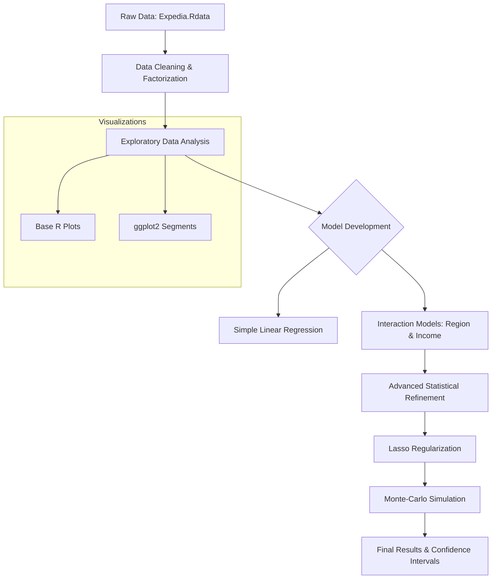
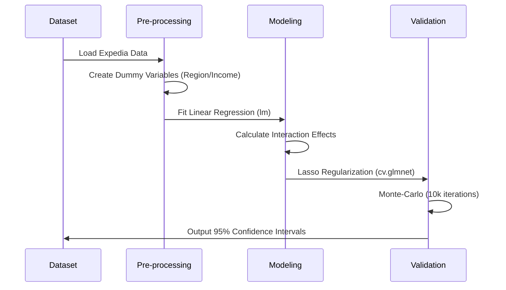

# Price Sensitivity and Booking Behavior Analysis

[](https://www.r-project.org/)
[](https://opensource.org/licenses/MIT)

## Executive Summary

This repository provides a comprehensive statistical analysis of hotel booking behavior, focusing on the relationship between price points, user demographics, and geographic regions. Leveraging Expedia dataset, the project employs exploratory data analysis (EDA), multi-variable linear regression, Lasso regularization, and Monte-Carlo simulations to quantify price sensitivity across diverse market segments.

The primary objective is to understand how a change in "Price Per Night" influences both the probability of a booking occurring and the total number of nights booked, specifically identifying how these sensitivities vary by user income level and destination region.

## Repository Structure

```text
├── data/
│   └── price-sensitivity-data.Rdata    # Primary Expedia dataset
├── scripts/
│   └── price-sensitivity-script.R      # Full R analysis pipeline
├── README.md                           # Project documentation
└── requirements.txt                    # List of required R packages
```

## Core Functionalities

### 1. Exploratory Data Analysis (EDA)
- **Visual Correlation**: Utilizes `ggplot2` to generate scatter plots with LOESS and linear regression smoothing to visualize the impact of price on booking outcomes.
- **Segmented Analysis**: Breaks down booking behavior by geographic region (Hawaii, Miami, Washington DC, Las Vegas) and user income brackets.

### 2. Statistical Modeling
- **Linear Regression**: Fits multiple models to estimate the base relationship between price and bookings.
- **Heterogeneous Interaction Models**: Incorporates interaction terms to capture how price sensitivity differs across various regions and income groups.
- **Transformational Analysis**: Evaluates various mathematical transformations (logarithmic, polynomial, exponential) to identify the best-fitting functional form.

### 3. Advanced Methodology (Added July 2025)
- **Lasso Regularization**: Employs `glmnet` to perform feature selection and prevent overfitting in complex models containing numerous interaction terms.
- **Monte-Carlo Simulation**: Runs 10,000 simulations to generate empirical 95% confidence intervals for the Lasso-regularized coefficients, providing robust uncertainty quantification.

## System Architecture & Data Flow

The following diagram illustrates the analytical pipeline implemented in this repository:



## Data Analysis Pipeline



## Getting Started

### Prerequisites
- R version 4.0.0 or higher
- Required R packages: `ggplot2`, `readr`, `glmnet`, `magrittr`

### Installation
1. Clone the repository:
   ```bash
   git clone https://github.com/your-repo/price-sensitivity.git
   ```
2. Install dependencies:
   ```R
   install.packages(c("ggplot2", "readr", "glmnet", "magrittr"))
   ```

### Execution
Run the main script to perform the full analysis:
```bash
Rscript scripts/price-sensitivity-script.R
```

## Conclusion

The analysis conducted in this repository reveals a significant inverse relationship between price per night and booking probability, as well as the duration of stay. Key insights include:

1.  **Price Elasticity**: Quantifiable metrics on how every $100 increase in price negatively impacts booking rates and the number of nights reserved.
2.  **Regional Heterogeneity**: Demonstrated that price sensitivity is not uniform; certain regions (e.g., Las Vegas vs. Hawaii) exhibit distinct consumer behaviors in response to price fluctuations.
3.  **Income-Driven Sensitivity**: Higher income brackets generally show lower price sensitivity, particularly regarding the probability of booking, whereas lower-income segments are more responsive to price changes.
4.  **Model Robustness**: By implementing Lasso regularization and Monte-Carlo simulations, we successfully addressed potential overfitting from interaction terms and provided statistically rigorous confidence intervals for our findings.

These results provide actionable intelligence for dynamic pricing strategies and targeted marketing campaigns within the travel and hospitality industry.

## Acknowledgments

Special thanks to **Professor Mike Palazzolo** (Assistant Professor of Marketing, UC Davis Graduate School of Management) for his invaluable guidance and for providing the foundational concepts and data used in this analysis.
